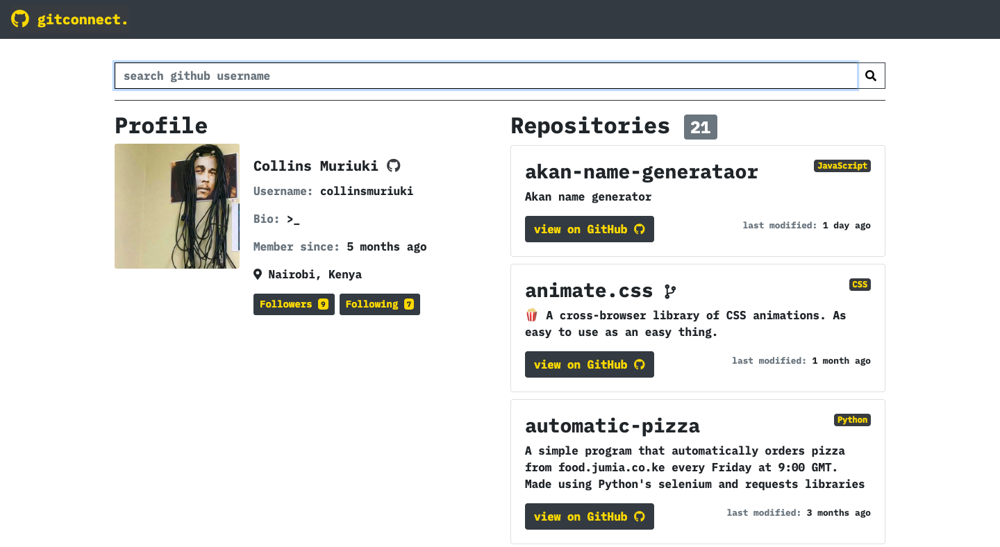
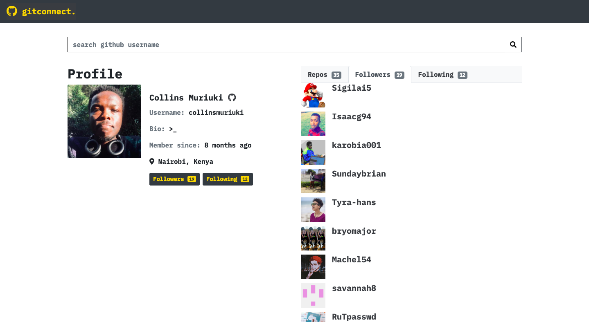

# gitconnect.
<p>
  
  <a href="LICENSE" target="_blank">
    
  </a>
  <a href="https://twitter.com/collinsmuriuki_" target="_blank">
    
  </a>
</p>

####  A simple github user search tool.






## Author

👤 **Collins Muriuki**

* Twitter: [@collinsmuriuki_](https://twitter.com/collinsmuriuki_)
* Github: [@collinsmuriuki](https://github.com/collinsmuriuki)

## Description
gitconnect is an app that allows a user to search for GitHub users and display their profile information as well as a glimpse of their repositories.

## Features
Here are the features in summary:
* A minimalistic landing page with a button that navigates user to the search page.
* A search page which allows the user to search for github users by typing in their usernames.
* A minimalistic display of the github user information and their repositories ordered alphabetically

## Behaviour Driven Development (BDD)
|Behaviour 	           |    Input 	                 |       Output          |
|----------------------------------------------|:-----------------------------------:|-----------------------------:|       
|Page loads, user arrives in the landing page, on clicking the begin search button, they are taken to the search page.                        |  The user , once in the search page, can search github usernames on the search box.          | The profiles of the users as well as their repos are displayed upon submission.    |                       |

## Requirements
* To run this app on your text editor, you will need the following:
    * Node: for installation instructions follow this [link](https://nodejs.org/en/download/)
    * Angular CLI version 8.0.3: installation of Angular is described [here](https://www.c-sharpcorner.com/article/three-steps-to-install-angular-and-create-first-hello-world-angular-app/) 
    * A github developer API token, clientId and client secret, all these can be gotten after [creating an application on github](https://github.com/settings/apps)

## Installation and Set-up
To view the app, open the live site link provided below on the README.
Here is a run through of how to set up the application:
* **Step 1** : Clone this repository using **`git clone https://github.com/collinsmuriuki/gitconnect.git`**, or downloading a ZIP file of the code.
* **Step 2** : The repository, if downloaded as a .zip file will need to be extracted to your preferred location and opened
* **Step 3** : Open the terminal, go to the project directory and download the dependencies in the package.json using **`npm install`**
* **Step 4** : On the root of the src directory, create an environments directory; inside, create two files, **environment.ts** and **environment.prod.ts**
    * In environments.ts copy this code:
        ```shell
            export const environment = {
            production: false,
            token: 'YOUR_TOKEN',
            clientId: 'YOUR_CLIENTID',
            clientSecret: 'YOUR_CLIENTSECRET',
            };
        ```
    * Anf finally in environment.prod.ts, copy the above code but change **production** key from false to **true**
* **Step 5** : Run **`ng serve`** on the terminal for a dev server. Navigate to http://localhost:4200/. The app will automatically reload if you change any of the source files

## Known Bugs
* Error messeage on typing in a username that cannot be found, is inconsistent.

## Technologies Used
* Angular CLI version 8.3.6.
* HTML  
* CSS
* Javascript
* Bootstrap 4.3.1
* font-awesome


## Support and contact details
You can provide feedback or raise any issues/ bugs through the following means:
* murerwacollins@gmail.com

## Live Site link
You can view the live application by following this [link](https://gitconnect-ip.firebaseapp.com/).

## Show your support

Give a ⭐️ if this project helped you!

## 📝 License

Copyright © 2019 [Collins Muriuki](https://github.com/collinsmuriuki).<br />
This project is [MIT license](LICENSE) licensed.

