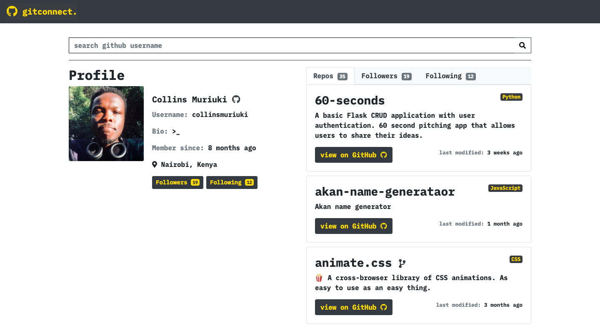

# gitconnect.
---
####  A simple github user search tool.

## Author
[Collins Muriuki](https://github.com/collinsmuriuki)

## Versioning
gitconnect Beta
Future releases should have the following features:
* Pagination for users with ore than 30 repos.
* A display of the list of a users followers and following profiles.

## Description
gitconnect is an app that allows a user to search for GitHub users and display their profile information as well as a glimpse of their repositories.

## Features
Here are the features in summary:
* A minimalistic landing page with a button that navigates user to the search page.
* A search page which allows the user to search for github users by typing in their usernames.
* A minimalistic display of the github user information and their repositories ordered alphabetically

## Behaviour Driven Development (BDD)
|Behaviour 	           |    Input 	                 |       Output          |
|----------------------------------------------|:-----------------------------------:|-----------------------------:|       
|Page loads, user arrives in the landing page                         |   User clicks, begin search button and is redirected to the search page.             |User can then search github usernames and the profiles of the users as well as their repos is displayed.    |                       |

## Requirements
* To run this app on your text editor, you will need the following:
    * Node: for installation instructions follow this [link](https://nodejs.org/en/download/)
    * Angular CLI version 8.0.3: installation of Angular is described [here](https://www.c-sharpcorner.com/article/three-steps-to-install-angular-and-create-first-hello-world-angular-app/)  

## Installation and Set-up
To view the app, open the live site link provided below on the README.
Here is a run through of how to set up the application:
* **Step 1** : Clone this repository using **`git clone https://github.com/collinsmuriuki/gitconnect.git`**, or downloading a ZIP file of the code.
* **Step 2** : The repository, if downloaded as a .zip file will need to be extracted to your preferred location and opened
* **Step 3** : Open the terminal, go to the project directory and download the dependencies in the package.json using **`npm install`**
* **Step 4** : Run **`ng serve`** on the terminal for a dev server. Navigate to http://localhost:4200/. The app will automatically reload if you change any of the source files

## Known Bugs
* Error messeage on typing in a username that cannot be found, is inconsistent.

## Technologies Used
* Angular CLI version 8.0.3.
* HTML  
* CSS
* Javascript
* Bootstrap 4.3.1
* font-awesome

## Support and contact details
You can provide feedback or raise any issues/ bugs through the following means:
* murerwacollins@gmail.com

## Live Site link
You can view the live application by following this [link]().

## License
#### [*MIT License*](LICENSE)

